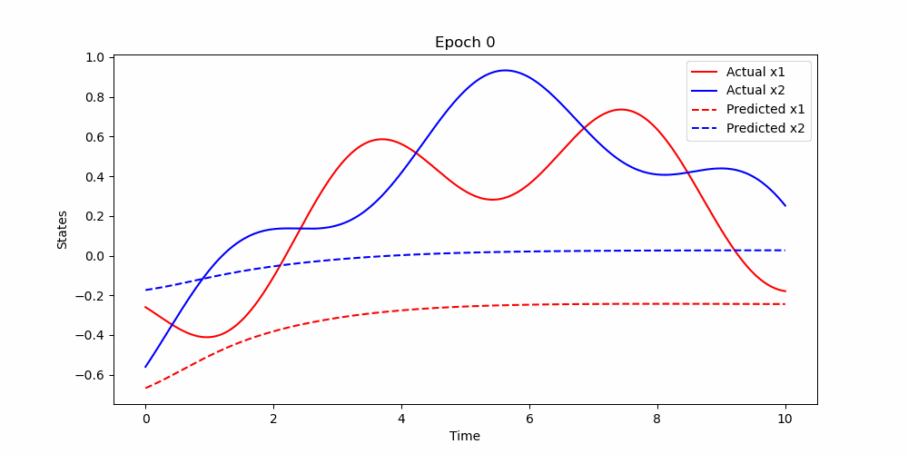
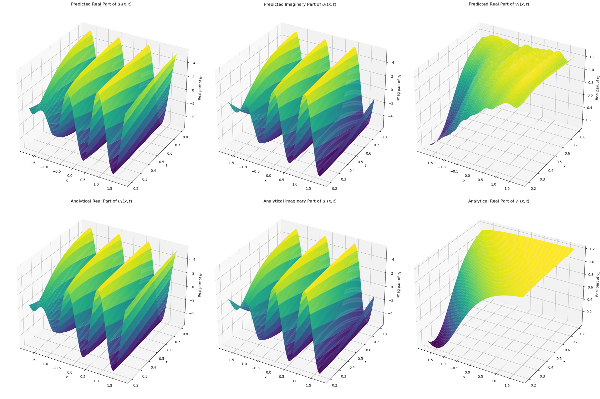
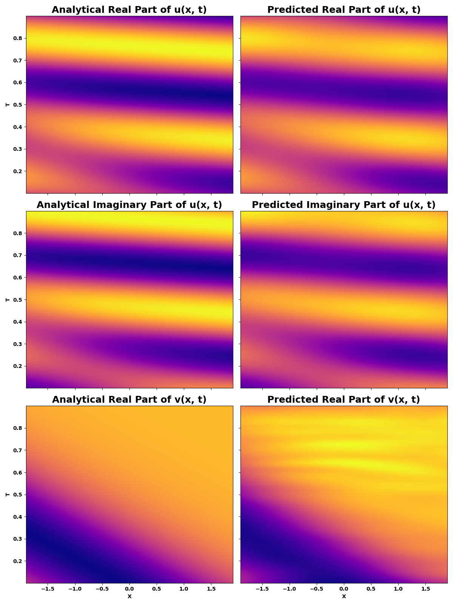

# Physics-Informed Neural Networks (PINNs) for Solving Physical Systems

This repository contains implementations of Physics-Informed Neural Networks (PINNs) to solve various physical systems described by partial differential equations (PDEs) or ordinary differential equations (ODEs). PINNs leverage the power of deep learning to approximate solutions to complex physical and quantum mechanical problems by incorporating physical laws as part of their loss function.

## Table of Contents

- [1D Harmonic Oscillator](#1d-harmonic-oscillator)
- [1D Quantum Harmonic Oscillator](#1d-quantum-harmonic-oscillator)
- [2-D PDE Example](#2-d-pde-example)
- [Symmetric Infinite Potential Well](#symmetric-infinite-potential-well)
- [Non-linear Schrödinger Equation](#non-linear-schrödinger-equation)
- [Coupled Spring system](#coupled_spring-equation)
- [Lotka-Voltera Equation](#lotka-voltera-equation)
- [Coupled Higgs Equation](#coupled-higgs-equation)
- [Installation](#installation)
- [Acknowledgments](#acknowledgments)

## 1D Harmonic Oscillator

The 1D damped harmonic oscillator is described by the differential equation:

$$m \dfrac{d^2 x}{d t^2} + \mu \dfrac{d x}{d t} + kx = 0$$

with initial conditions $x(0) = 1$, $\dfrac{d x}{d t}(0) = 0$. We focus on solving for the under-damped state ($\delta < \omega_0$).

Original code inspired by [benmoseley](https://github.com/benmoseley/harmonic-oscillator-pinn).

## 1D Quantum Harmonic Oscillator

Solves the quantum harmonic oscillator problem, given by the Hamiltonian:

$$\hat{H} = \frac{\hat{p}^2}{2m} + \frac{1}{2}m\omega^2\hat{x}^2$$

and the corresponding Schrödinger equation. The solution involves the eigenfunctions $\psi_n(x)$ expressed in terms of Hermite polynomials $H_n$.

## 2-D PDE Example

A simple 2-D PDE problem:

$$\frac{du}{dx} = 2 \frac{du}{dt} + u$$

with boundary condition $u(x,0) = 6e^{-3x}$. The analytical solution is $u(x,t) = 6e^{-3x-2t}$.

Original code by [nanditadoloi](https://github.com/nanditadoloi/PINN/tree/main).

## Symmetric Infinite Potential Well

Solves the time-dependent Schrödinger equation for a particle in a symmetric infinite potential well, focusing on the solutions within the well and the quantized energy levels.

## Non-linear Schrödinger Equation

Addresses the non-linear Schrödinger equation with periodic boundary conditions, showcasing the use of PINNs in solving complex, non-linear PDEs.

$$
i \frac{\partial \psi}{\partial t} + \frac{1}{2} \frac{\partial^2 \psi}{\partial x^2} + |\psi|^2 \psi = 0, \quad x \in [-5, 5], \quad t \in [0, \frac{\pi}{2}],
$$

## Coupled Spring system 

Here we try to solve the spring that has the lagrangian 

$$
L = \frac{1}{2} m_1 \frac{d^2x_1}{dt^2} + \frac{1}{2} m_2 \frac{d^2x_2}{dt^2} - \frac{1}{2}\left(k_l x_1^2 + k_r x_2^2 + k_m (x_1 - x_2)^2\right)
$$



## Lotka-Volterra Equation

The Lotka-Volterra equations, also known as the predator-prey model, are represented as a system of first-order nonlinear differential equations:

$$
\begin{cases}
\frac{dx}{dt} = \alpha x - \beta x y, \\
\frac{dy}{dt} = \delta x y - \gamma y,
\end{cases}
$$

where
- $x$ represents the prey population,
- $y$ represents the predator population,
- $\alpha$ is the natural growth rate of prey in the absence of predators,
- $\beta$ is the natural dying rate of prey due to predation,
- $\delta$ is the efficiency of converting consumed prey into predator population, and
- $\gamma$ is the natural dying rate of predators in the absence of prey.

The constants are normalized for this demonstration with $\alpha = 40$, $\beta = 160$, $\delta = 80$, $\gamma = 21.2$, and the initial condition set to align with the demo (max population 200) as $x(0) = \frac{100}{200}$, $y(0) = \frac{15}{200}$. A solution visualization is available online at [geogebra](https://www.geogebra.org/m/ztcqv8gb).

## Coupled Higgs Equation

$$
u_{tt} - u_{xx} + |u|^2 u - 2uv = 0
$$

$$
v_{tt} + v_{xx} - (\left| u \right|^2)_{xx} = 0
$$

where, $u(x,t)$ represents a complex nucleon field and $v(x,t)$ represents a real scalar meson field. The coupled Higgs field Equation describes a system of conserved scalar nucleon interaction with a neutral scalar meson.

solutions 

$$
u_1(x, t) = ir e^{ir(\omega x + t)} \sqrt{1 + \omega^2} \tanh\left(\frac{r(k + x + \omega t)}{\sqrt{2}}\right)
$$

$$
v_1(x, t) = r^2 \tanh^2\left(\frac{r(k + x + \omega t)}{\sqrt{2}}\right)
$$

where 
$k = 0.5, \omega = 3 , \alpha = 2, c = 2, r = 1.1$






## Installation

For nixpkgs users use the following 
```bash
git clone https://github.com/mushrafi88/Physics-Informed-Neural-Networks-for-Quantum-Dynamics.git
cd Physics-Informed-Neural-Networks-for-Quantum-Dynamics 
NIXPKGS_ALLOW_UNFREE=1 nix develop --impure
```

## Acknowledgments

- Original PINN methodology by [Raissi et al.](https://www.sciencedirect.com/science/article/abs/pii/S0021999118307125)
- Example implementations inspired by contributions from [benmoseley](https://github.com/benmoseley/harmonic-oscillator-pinn) and [nanditadoloi](https://github.com/nanditadoloi/PINN/tree/main).


